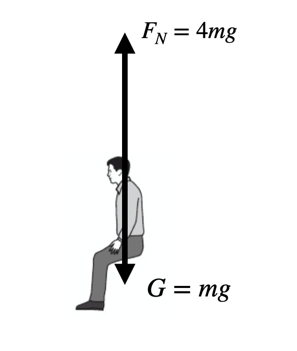
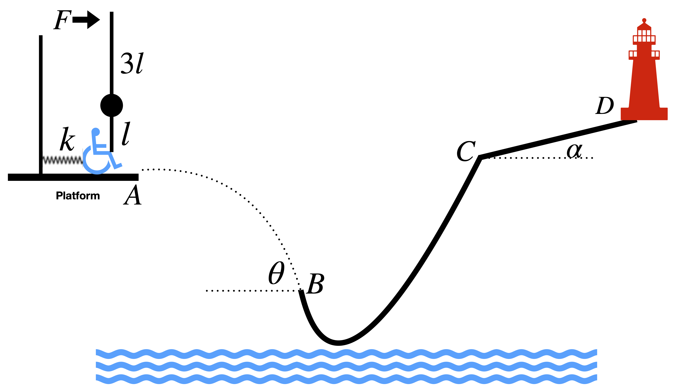

# Part 1: Mechanics
## Chapter 1  Kinematics

## Chapter 2  Dynamics: Newton's Law

## Chapter 3  Forces

## Chapter 4  Energy

## Chapter 5  Momentum

## Chapter 6  Elasticity

## Chapter 7 Circular motion

Circular motion is the simplest form of a motion along a *curved trajectory*. 

### How the motion can take turns

The acceleration changes the velocity, not only the magnitude, but also the *direction*. The simplest way to change the direction is applying the acceleration so that it only changes the direction, but no magnitude. This is achieved by making the acceleration *perpendicular to the velocity*.

Remember: instantaneous acceleration can be decomposed as two components -- parallel or penpendicular to the velocity. The parallel component changes the magnitude of the velocity, the perpendicular one changes the direction. **This only applies on instantaneous acceleration!** 

### Circular motion at constant speed

If the trajectory is a circle, this motion is called the *circular motion*. The simplest way is that the speed is not changed, that is, the magnitude of the velocity is constant. 

**Remember**:
- The speed is not changed, but the direction of motion is always changing: they are always along the tangential direction of the circle.
- The direction of the acceleration is always changing: always pointing to the center. The magnitude is constant.

To describe the circular motion, we need to get used to a new unit: the *radian*. We know that for a angle at the center of a circle, the arc length that corresponds to this angle is proportional to it: $l \propto \theta$. We also know that $l \propto r$. So we define the radian unit so that $l=r\theta$. For example, a whole angle, $360^\circ$, corresponds to a whole circle. So $360^\circ = 2\pi \ \rm rad$.

Quantities that describe this kind of motion includes:
- Speed $v$.
- Angular speed $\omega$, describing how large the angle it can rotate in unit time. We have $\omega r = v$.
- Period $T$, describing the time for a whole circle. We have $T = 2\pi / \omega$
- Frequency $f$, describing how many circles can be finished in unit time. $f=1/T$.
  

For this kind of motion, the acceleration is
$$
a = \frac{v^2}{r} = \omega^2 r
$$
this acceleration is called the *centripetal acceleration*.

### Centripetal force

To finish the circular motion, we need a force to offer the centripetal acceleration. Thus we required a force equals to $ma$. This force is called *centripetal force*, written as:
$$
F = m \frac{v^2}{r} = m \omega^2 r
$$

This force is not an actual force. Instead, it is a *requirement* to finish the circular motion. It's the actual forces: gravity, pushing, pulling, spring, friction forces, etc, that offers the centripetal force. 

### Solutions to Book2 Practice
1. C. Unit should be inverse of time.
2. B. Worn tyres causes smaller friction, which is probably not able to offer enough centripetal force.
3. B. Use formula $\omega = \theta/t$, we have $\omega = 2 \pi \times 14.5/60\  \rm rad/s = 1.52\ \rm rad/s$.
4. C. The string is holding the mass. Notice that the motion is in a horizontal circle, so gravity does not participate in this motion.
5. (a) At first the train is moving along the horizontal track. It is a simple acceleration along a straight line. So:
  $$
    a = \frac{\Delta v}{\Delta t}
  $$
  Force is calculated by:
  $$
    F = ma = 12000 * \frac{57-0}{3.5} = 195429 \ \rm N
  $$

  (b) 
  

  
  

  (c) The "radius of curvature" is nothing but the radius of the circular motion. X is just the starting point of the circular motion. So simply plug in the formulas for that. From
  $$
    F = m\frac{v^2}{r}
  $$
  we have 
  $$
    r = \frac{mv^2}{F} = \frac{v^2}{3 g} = \frac{57^2}{3 \times 9.8} = 110.51 \ \rm m
  $$

  (d) During the motion, kinetic energy is tranferred into gravitational potential energy (because resistance is negligible). We can write down:
  $$
    \Delta E_p = - \Delta E_k
  $$
  Thus 
  $$
    mg(h_{\rm top} - h_{\rm bottom}) = mgh = - (\frac{1}{2}mv_2^2 - \frac{1}{2}mv_1^2) = \frac{1}{2}m(57^2 - 20^2)
  $$
  Solve this equation we can get $h=145 \ \rm m$. 
  We can also understand the process by kinetic energy theorem: works exerted by external forces on the body changes the kinetic energy. Here, the works is done by the gravitational force, which is negative work. So:
  $$
    -mgh = \frac{1}{2}mv_2^2 - \frac{1}{2}mv_1^2
  $$
  This equation is the same as the above.
  (e) Point Y is just the top point. Weightless means that there is no interaction between the rider and the seat (the "reaction force" is $0$). The gravitational force is just enough to offer the centripetal force. The speed at Y is just $20$ that we used in the above question. So:
  $$
    mg = m\frac{v_2^2}{r_Y}
  $$
  Then we can solve the $r_Y = v^2_2/g = 40.8\ \rm m$.
6. (a) "20 revolutions per minute". So $\omega = 20 \times 2\pi/60 = 2\pi/3\ \rm rad/s$.
   (b) Acceleration is just $\omega^2 r = g$, thus we can solve for $r$.
7. (a) $T = 2\pi r/v = 1474\ \rm s$.
   (b) $F = mv^2/r = 10.75\ \rm N$
   (c) (i) Simply draw arrows that pointing into the center.
   (ii) Maximum: at the bottom: $F_n - mg = F_c$. Minimum: at the top: $mg - F_n = F_c$.

## Chapter 8 Gravitation

Previously our understanding to gravitation is simply "weight is gravitation". This is not the case, however. Weight is not a fundamental force. In contrast, it's part of the gravitation given by the earth. To understand the gravitation comprehensively, we should jump beyond the earth and into the universe. This chapter leads you to take a look at the earth from a higher point of view.

### Gravitational forces

Gravitational forces is the interaction between objects due to the mass they own. In other words, any objects must have this interaction with each other as long as they have non-zero mass (we will encounter particles with zero mass in the future). The force has the form:
$$
  F = \frac{GMm}{R^2} 
$$
where $G = 6.67 \times 10^{-11}$ is the gravitational constant. $M$ and $m$ are the masses of the interacting bodies. $R$ is the radius between them. Forces with this form is called "inverse square law": the force is inversely proportional to the square of the distance. The Coulumb's law, which is the interacting forces between electric charges, is also a inverse square law. We will dig deeper about this kind of forces in the future.

Usually, we use the symbol $M$ to represent the celestial body at the center. For example, a person who stands on the surface of the earth will receive a gravitational force $F_G = GMm/R^2$ where $R$ is the radius of the earth. And, comparing with the weight $mg$, we can easily see that $g = GM/R^2$. Similarly, we can calculate the force on the surface of other stars, or the force from earth when flying in the outerspace.

### Gravitational fields

This is the first time we encounter the concept of "field". The gravitational field is produced by the central celestial body, and interacts on the flying body. (*Of course, inversely, we can also consider the flying body creates a field and interacts on the celestial body. But in astronomy and cosmology, since the flying body is too light, we never count there field. So from now, we are getting used to calculate the field from the center celestial body*.)

How to understand that? From the force law $F = GMm/R^2$, we can easily see that the force is proportional to the flying body for a fixed center star. The coefficient for this fixed star is only dependent on the distance. For example, if we are talking about the force from the earth to the flying spaceship, then the force on the spaceship should obey $F \propto m_{\rm ship}$. The proportional coefficient is just $GM/R^2$. This coefficient, if we are keep talking about the earth (which means $M$ is not changed), is only dependent on $R$.

We define this coefficient "gravitational field" as:
$$
g \equiv \frac{GM}{R^2}
$$
Gravitational field is a **vector**. It always points into the center celestial body that creates this field. Note that if we switch to talk about another star, like moon, the $M$ changes, and at that time we are talking about a new different field produced by the moon, $g_{\rm moon} = GM_{\rm moon}/R^2$.

Why we use the same symbol $g$ for the field and the gravitational acceleration? Now you can see that they are the same thing! Both of them gives $F_G = mg$. So we say that the symbol $g$ represent both the acceleration and the gravitation. It has two unit (of course these two units are equivalent): $\mathrm{kg \cdot m \cdot s^{-2}} = \mathrm{N/kg}$. You can try to prove this.

#### What is field? (Jump this subsection if you want, but encourage to read)

A "field" is defined as something that depends on the location. For example, the altitude of the earth surface depends on where you are talking about (Of course! The Mount.Zhumulangma has the different altitude with the Mariana Trench!). We say that the altitude of the surface is a **field function** that depends on the location $x$, where $x$ is a vector that can pinpoint the location on the earth. Note this function as $A(x)$. (You may not be familiar with this symbol for now. But you will learn this symbol at the first math class in high school.)

Another example is the familiar linear function $y = kx + b$. We can regard $x$ as the location. Now we say that **$y$ is a function of the location $x$**. We can also call $y$ a field.

Now go back to the gravitational field. The field $g = GM/R^2$ is absolutely a function of location $R$. So we call it a field. 

Why we do not call the force $F = GMm/R^2$ a field? The reason is it also depends on the flying body $m$. We would like to have a look at something that is independent of the body.

But you may further ask: the gravitational field $g = GM/R^2$ also depends on the $M$! Why you do not apply the same reason for this $M$? Well, this $M$ is from the one who creates the field. Without the $M$ we do not have this field. If we change $M$, yes you can, but then we are talking another field from another celestial body. **For the same celestial body who is creating a certain field**, the $M$ is a constant.

### Gravitational potential

We talked about the gravitational potential energy in terms of weights $mg$ before. But this time we are looking at the potential energy in the outerspace. 

The definition of the potential energy should be the same: it's a kind of energy that is stored in the interactions. The interactions tends to release the energy and this energy will be transformed into kinetic energy. Previously, the way we define the gravitational potential energy is the same as the opposite of the works done by the gravity when we push something from the 0-energy point to the current location.

For example, we choose a surface to have 0 potential energy. Lift a body with mass $m$ to the height $h$. The work done by the gravity is negative: $W_G = - mgh$. We say that the potential energy is $mgh$. (Remember, the negative work from gravity means that the gravity turns other type of energy into gravitational potential energy. So we can understand this process as: during lifting, gravity does negative work and turns some energy into gravitational potential energy. The amount is $mgh$. Then this point has the potential energy $mgh$.) We summarize the process as:

$$
E_{pG\text{ at }h} = -W_{G, \text{0 to h}}
$$

Now apply it to the universe. First question: how to define the zero-energy point? The answer is: at infinity!

Now we define infinity to be 0 potential energy. Push the item back and we can get the potential energy. The problem is: the force is varying during the whole process!

This calculation needs calculus. You will learn about this after you pass AS exam. Now I just show you the result:

$$
E_{pG} = - \frac{GMm}{R}
$$

This is the gravitational potential energy.

Now we have another task. For forces, we search for an quantity that is independent of $m$ and we call it field. For potential energy, shouldn't we do that?

Yes, we should. The answer, of course, is again the coefficient of $m$:
$$
V \equiv \frac{E_{pG}}{m} = -\frac{GM}{R}
$$
We call this quantity **gravitational potential**. It only depends on $M$ and $R$.

### Gravitational force guides the space motion

Now we are well-equipped to calculate the phenomena of spaceship rotations. The only thing we need to do is: the gravity offers the centripedal force. 
$$
F_G = F_c
$$
For example, the geostatic satellite is rotating around the earth with the same period of earth spin: 24 hours per revolution. What is the height from the surface?

The answer is simple:
$$
\frac{GMm}{R^2} = m\omega^2 R = m \left(\frac{2\pi}{T} \right)^2 R
$$
solve this equation we get:
$$
R^3 = \frac{GM}{4\pi}T^2
$$
Further, we should notice that here the $R$ is the distance from the center of earth to the satellite. The distance from the surface to the satellite is $R - R_{e}$, where $R_e$ is the earth radius.

From the above example, we can found that the result does not depend on the flying mass $m$. Actually, this is the most case in this chapter. Remember, gravity offers the centripedal force, gravity offers the acceleration. For any question about flying body, write down this equation and you will solve that. No exceptions.

## Review Project 1: Crazy Alex Yu

Alex Yu wants to go to the tower across the river. There is no bridge, no boat,
no plane, no any transportation. But she is crazily enthusiastic. She must arrive the tower.

Her teacher, Isaac Wang, is helping her design a
crazy facility so that this crazy guy and arrive the other side of the river.

### Part 1: Ejection from the spring

She sits in a small chair with wheels, holding on the spring by a rod which is
attached to an rolling axis. A known force $F$ is pushing the top of the rod so
that Alex is holding at the position. The spring is compressed. The platform is
smooth. Then release the force $F$, she is ejected, and flies out the platform at point A.

Known quantities: force $F$, rod length $l$ and $3l$, spring constant $k$, and mass of you and your car $m$.

- Initially, Alex is hold at that position. What is the force from the spring that makes her in equilibrium?
- How much length is the spring compressed?
- Once she is well prepared, the force $F$ is released, and Alex is ejected out. What is the speed of her after she leaves the spring?
  
**Solutions** : 
- For Alex, two forces are exerting on her: the spring force and the rod force. For the rod, two forces combined to keep it in rotation equilibrium: the force from Alex, and the external force $F$. Thus we can write down the equation for the equilibium of the rod rotation:
$$
  F_{spring} l=F \cdot 3l
$$
Thus we have 
$$
F_{spring} = 3F
$$

- The spring force is given by the Hooke's law: $F_{spring} = k \Delta x$, so we have
$$
\Delta x = \frac{3F}{k}
$$

- Here, the elastic potential energy stored in the spring is transformed into the kinetic energy of Alex. The initial elastic potential energy is:
  $$
  E_p = \frac{1}{2}k \Delta x^2
  $$
  The final kinetic energy is:
  $$
  E_k = \frac{1}{2} m v^2
  $$
  We have $E_p = E_k$, so the velocity is:
  $$
  v_A=\frac{3F}{\sqrt{mk}}
  $$

### Part 2: Flying in the sky

After ejected from the platform, she flies in the sky and exactly enters the track at point B.
(by "exactly", it means that the velocity direction is exactly parallel to the direction of the track at point B)

Known quantities: the angle $\theta$, and all the quantities solved above.

- What is the initial velocity when she flies out from the platform?
- What is the horizontal and vertical velocity at point B?
- How much time does she fly from A to B?
- What is the horizontal and vertical distance from A to B?

**Solutions**:

- Of course the initial velocity is just the velocity $v_A$.
- From A to B, Alex has two motions: in horizontal direction, the motion is at a constant velocity. While at vertical direction, it's at a constant acceleration $g$ with zero initial velocity. So the horizontal velocity at B is still equals to that at A: 
  $$v_{Bx}=v_A$$
  
  We do not know the time so far, so we cannot directly calculate the vertical velocity at B. However, we know that the direction of the total velocity at B is along $\theta$, so 
  
  $$v_{By} = v_{Bx} \tan \theta = v_A \tan \theta$$

- Now we can solve the time: from 
  $$v_{By} = g t$$
  we get
  $$t_{AB} = v_{By}/g = \frac{v_A \tan \theta}{g}$$ 

- With time calculated, we can immediately get the displacement:
  $$
  x_{AB} = v_A t_{AB} = \frac{v_A^2 \tan \theta}{g} \\
  y_{AB} = \frac{1}{2} g t_{AB}^2 = \frac{v_A^2 \tan^2\theta}{2g}
  $$

### Part 3: Running in the track

After she enters the track at point B, she runs along the track and finally arrives C. No energy lost at point B during she enters the track. But remember, this car has no engine.

The track is smooth, but not straight. No energy lost while moving in the track.

Known quantities: height between B and C $h_{BC}$, and the quantities calculated above.

- What is the kinetic energy at point B?
- What is the change of gravitational potential energy from B to C?
- What is the speed at point C?

**Solutions**:
- Kinetic energy is simply:
  $$
  E_k = \frac{1}{2}m v_B^2
  $$
- The gravitational potential gets higher. Since we know that
  $$
  h_{BC} = h_C - h_B
  $$
  we know that
  $$
  \Delta E_{p}=E_{pC} - E_{pB} = mgh_C - mgh_B = mgh_{BC}
  $$
  This is a positive value.
- During this process, energy is conserved: kinetic energy is transferred into gravitational potential energy. We can write down:
  $$
  \Delta E_k = \frac{1}{2}m(v_C^2 - v_B^2) = -\Delta E_p = -mgh_{BC}
  $$
  Solve this equation and we can get 
  $$
  v_C = \sqrt{v_B^2 - 2gh_{BC}}
  $$

### Part 4: Running along the slope

After finishing the track, she arrives point C. Now the tower is exactly at D. Only a straight way remaining! No energy lost at point C. That means, the speed at C when her leave the track BC is the speed that she starts moving along CD.

But this way is not smooth. The friction is $f$. She exactly stops at D finally.

Known quantities: slope of CD $\alpha$, and all the quantities calculated above.

- How many forces are exerting on her?
- What is her acceleration?
- She finally stops at D. How long is CD? How much time does it take?

**Solutions**: 
- Gravity, supporting force from the slope, and friction.
- Decompose the forces along the slope. Friction is down along the slope. One componenet of gravity also points down along the slope. So the acceleration is given by:
  $$
  f+mg\sin \alpha = ma
  $$
  so
  $$
  a = g\sin \theta + \frac{f}{m}
  $$

- Write down the equation:
  $$
  0 - v_C^2 = -2 a l_{CD}
  $$
  so
  $$
  l_{CD} = \frac{v_C^2}{2(g \sin \theta + f/m)}
  $$

**Congratulations to Alex Yu. She finally arrives the tower! (Although she is
crazy...) Let's move on to the next journey!**

# Part 2: Thermal Physics

# Part 3: Electricity and Magnetics

# Part 4: Modern Physics
